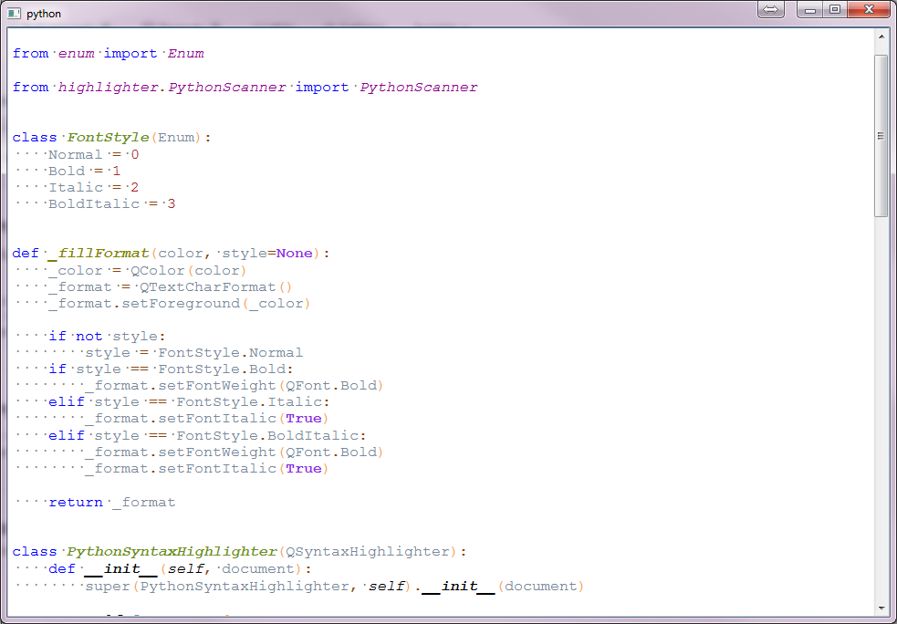

# PythonEditor
Use Qt5 Widget for editing python sources on PyQt5 Application


Run the following commands:

```bash
python configure.py
make 
sudo make install
```
       
Example:

```bash
cd Example
python main.py
```
 
Output: 

